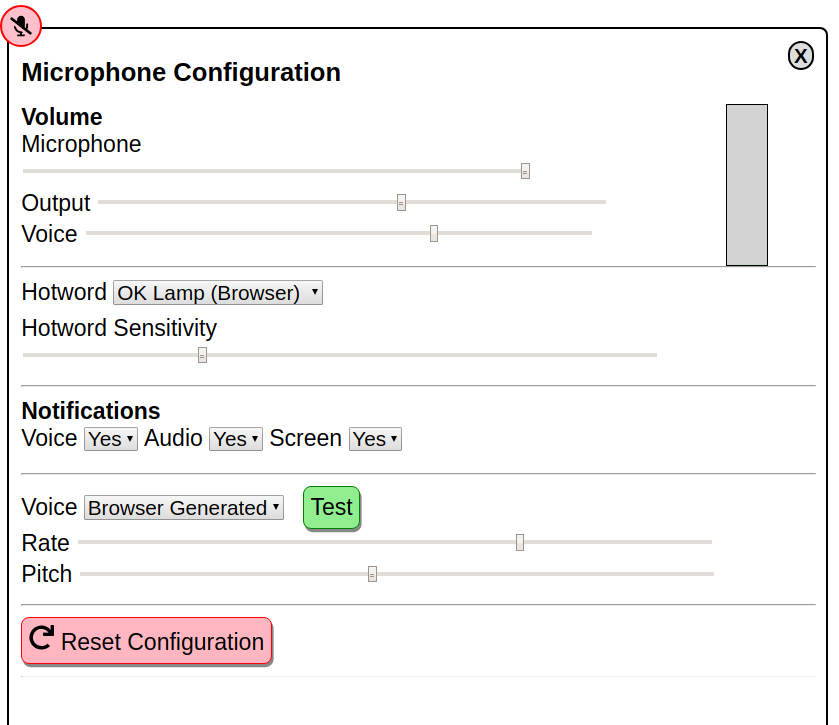
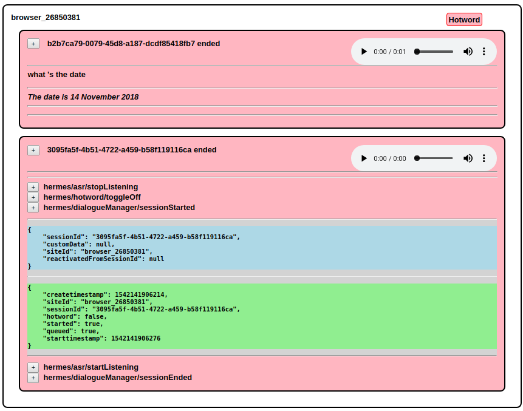
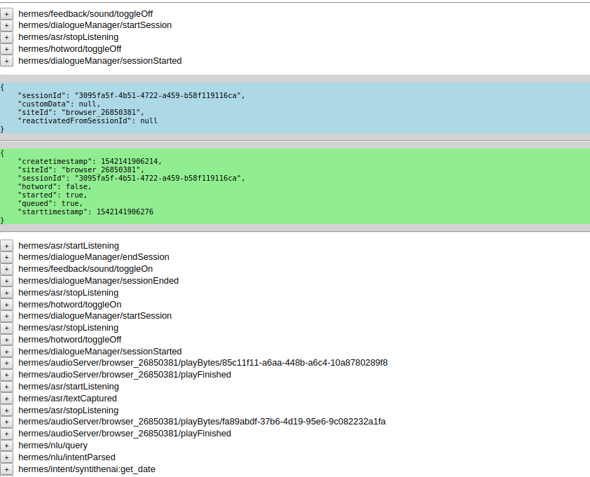

# snips-react-satellite

React component providing a microphone that works with [Snips](http://snips.ai).
Implements audioserver,hotword,tts and skill-server elements of the Hermes protocol.


## About

This package provides a React component that shows a microphone and streams audio over mqtt in a dialog suitable for the [Snips Voice Platform](https://snips.ai) making it easy to develop web applications that behave as satellites in the Snips ecosystem.

!! The package is still a work in progress. See below for bugs. Seems mostly fine with Chromium and Firefox on Linux.

Would love help !! Bug reports, feature requests, suggestions for the bugs or thoughts below or best yet pull requests :)


## Features

- implements audioserver elements of the Snips hermes mqtt protocol supporting streaming audio to and from the browser.

- optionally implements the hotword server elements of the Snips hermes mqtt protocol using Porcupine running with WebAssembly in the browser. Currently the only available hotword is "Ok Lamp" (or a range of colors). 

    - I've requested snips and mycroft [here](https://github.com/Picovoice/Porcupine/issues/95).

- implements the tts  server elements of the Snips hermes mqtt protocol using native voices or falling back to speak.js javascript tts generation. 

- implements application server listening for hermes/intent/# to build applications that run in the browser in response to speech commands.
    - eventCallbacks and intents make it easy to customise and build applications without thinking about MQTT.

- long press or right click to show configuration page to configure volume, text to speech, hotword and notifications.

- logs showing asr transcripts, intent and tts plus audio recordings for each asr transcript.

- decomposed React components allow flexibility in implementing voice features in a web application.


## BUGS/TODO

- test/debug multi platform support (developed with Chromium on Linux)
    - Android 
        - firefox works but sometimes glitchy. Fail on first attempt.
        - chrome gives warning, mic access on https only (not localhost) TODO test this.
        - edge seems to work but doesn't
    - Linux
        - chromium works but has no TTS voices. log warning about upcoming autoplay changes.
        - firefox works but the TTS voices are awful and there is no volume control.
    
- remove hack for initialising dialogueManager start/stop session

- check autoplay compatibility
index.es.js:467 The Web Audio autoplay policy will be re-enabled in Chrome 71 (December 2018). Please check that your website is compatible with it. https://goo.gl/7K7WLu

- packaging of porcupine, paho and speak client. I was only able to make these libraries work by including them globally in the example/public/index.html file and using /* global paho */  to gain access within react. I would like to be able to include these as packages so the developer can use npm normally. 

- ???? non repeatable
    - memory overrun -  this.setState(this.state);

    - random mqtt dropouts
        - WebSocket connection to 'ws://localhost:9001/mqtt' failed: A server must not mask any frames that it sends to the client.
        - mqttws31.min.js:36 WebSocket connection to 'ws://localhost:9001/mqtt' failed: Invalid frame header
        - index.es.js:149 ["  SERVER onConnectionLost:AMQJS0008I Socket closed."]

    - double send tts
    - double audio capture
    - multiple browser sites in log 


- hotword reload on config change. picovoice doesn't restart on recreate instance.
- wait for sayFinished before end session after intent


## Questions/Thoughts

1. Currently the microphone component does a little dance when it loads to force Snips to listen.
    - start session
    - wait for session to start plus half a second while audio streams then end session.
    
    - Without this "initialisation", the snips dialog manager will start a session, send the blip sounds and send asr/startListening on the browser site but never sends textCaptured or stopListening.

    - This first session is visible in the demo log view.


2. ?? scalable use for a website would require the possibility for clients to subscribe to based on their userId and/or siteId to limit the mqtt traffic that is received.

    - To implement this would require that some services in the Hermes protocol suite to optionally support the userId/siteId in the topic string. ????


3. To use the server hotword requires configuration in snips.toml to explicitly list siteIds on which to listen for the hotword.
It would be useful allow wildcard configuration so for example all "browser_*" sites could be allowed for hotword listening.

4. It would be useful if audioserver/playBytes messages could be discriminated by purpose - eg hotword bleep notifications, tts, general audio so that the client could choose to mute any of these categories. 

    - While TTS is currently local to the browser (and can be filtered), better voices would be available by sending tts/say which triggers audioserver/playBytes using a server created audio file of the text.
    


## Screenshots









## Quickstart

- !! Ensure the snips voice services are running on localhost. The package only makes sense when used with a Snips voice server.

- !! Note that the mqtt server must support web sockets for a web browser to talk directly.
    - There are no settings in the snips mqtt server for websockets so an external broker may be required.
See the docker files for websocket configuration of mosquitto.


Run the example

```
git clone https://github.com/syntithenai/opensnips.git
cd snips-react-satellite
npm install
npm start

```


## Install

```bash
npm install --save snips-react-satellite

!! ensure global script files are included as per example

```


## Usage


At  bare minimum just include the satellite component in your layout.

```jsx
import React, { Component } from 'react'

import {SnipsReactSatellite} from 'snips-react-satellite'

class App extends Component {
  render () {
    return (
      <SnipsReactSatellite  />
      
    )
  }
}
```


By lifting the scope of the logger, it can be shared with other components.

```


export default class App extends Component {
    
    constructor(props) {
        super(props);
        this.state={}
        this.setLogData = this.setLogData.bind(this);
        this.siteId = 'browser_'+parseInt(Math.random()*100000000,10);
        this.logger = new SnipsLogger({logAudio:true,setLogData:this.setLogData });
    }
    
   setLogData() {
        this.setState( this.state );  // force update
   };
                  
  render () {
    return (
        <div>
            <SnipsReactSatellite logger={this.logger} siteId={this.siteId} intents={this.intents} />
           
             <br/><br/><br/><br/><br/><br/><br/>
             <hr/>
            <SnipsReactLogger logger={this.logger} {...this.logger.state} siteId={null}/>
            <hr/>
            <SnipsReactFlatLogger logger={this.logger} {...this.logger.state} siteId={null}/>
            
        </div>
    )
  }
}

```


Alternatively a more fine grained approach is to use individual components.
A siteId is shared across all components as is the logger instance.

Hotword and App Server are optional can be disabled by removing the component.

!! Microphone, TTS and Speaker components are necessary elements of the Snips dialog flow, without sayFinished and playFinished, the dialogueManager will pause.

In the future alternate components could be swapped in to mute audio or use network provided tts (that implement say/playFinished)

```
import {SnipsReactHotwordServer,SnipsReactMicrophone,SnipsReactTts,SnipsReactSpeaker,SnipsReactAppServer} from 'snips-react-satellite'

class App extends Component  {

    constructor(props) {
        super(props);
        this.siteId = props.siteId ? props.siteId : 'browser_'+parseInt(Math.random()*100000000,10);
        
        this.state = {config:{}}
        this.logger = props.logger ? props.logger : new SnipsLogger({logAudio:false,setLogData:this.setLogData });
    }  
    
    render() {
        let position=this.props.position ? this.props.position  : 'top left'
        return <div id ="snipsreactsatellite" >
            <SnipsReactHotwordServer toggleOn={true} logger={this.logger} siteId={this.siteId} config={this.props.config} />
            <SnipsReactMicrophone position={position} logger={this.logger} siteId={this.siteId} config={this.props.config} />
            <SnipsReactTts logger={this.logger} siteId={this.siteId}  config={this.props.config}/>
            <SnipsReactSpeaker logger={this.logger} siteId={this.siteId}  config={this.props.config}/>
            {this.props.intents && <SnipsReactAppServer logger={this.logger} intents={this.props.intents}  config={this.props.config} />}
            
        </div>
    };

  
}


```

## Classes

### SnipsMqttServer
Base class that manages mqtt connection

### SnipsLogger
Captures mqtt events into a data structure of sites and sessions. Optionally captures audio.
There is a SnipsLogger component required for all the SnipsReact components below.

The logger captures
- messages (all mqtt messages)
- sites (mqtt messages collated by siteId then sessionId)
- sessionStatus (status codes keyed by sessionId. status updated at key points in the session lifecycle)
- hotwordListening (current state of hotword toggle per siteId)
- audioListening (current state of audio streaming per siteId)
- lastSession (last active session keyed by site used to lookup session for mqtt requests that only specify the siteId)

The logger provides
- getSession(siteId,sessionId) where only one of the two values is required.

The logger allows registration of event callbacks keyed by "normalised" mqtt subjects.

See eventFunctions for the list of Snips topics with implementations to update status and state.

Use addCallbacks to register an object of callbacks that are called after the eventFunctions with matching topic and siteId.

```
addCallbacks({'hermes/intent/#':function() {console.log('doit')}},oneOff = false)
```

Callbacks can be added as 'oneOff' in which case they are deregistered after they are called. 

This feature is useful to allow code describing a trigger action, a wait for mqtt message, then further action all in one code block.


### SnipsReactComponent
Base class for SnipsReact components below. Contains sendMqtt commands - sendEndSession etc.


## Components


### SnipsReactSatellite
Combination of components to implement Snips satellite.

The satellite passes all it's properties through to child components.

If no siteId property is provided, one is generated.
If no logger is provided, one is created and shared with the child components.


### SnipsReactHotwordServer
The hotword server  component listens for hermes/hotword/toggleOn and toggleOff.
When the hotword is toggled on, the browser starts listening for the hotword and sends hermes/dialogueServer/startSession when the hotword is detected.

A choice of hotwords and hotword sensitivity is available in the config panel.

### SnipsReactMicrophone
The speaker component listens for hermes/tts/startListening and stopListening and starts/stops streaming audio packets over mqtt.

If the prop "enableServerHotword" is true. Audio packets are streamed between hermes/hotword/toggleOn and toggleOff as well.

At this time the Snips hotword must be configured  (in snips.toml) with the siteId of any hotword satellites and the browser siteId must be fixed to a configured value to be able to use server side hotword.


### SnipsReactTts
The speaker component listens for hermes/tts/say on the configured siteId and generates and plays the words through the browser.

The microphone configuration panel offers choices of speech rate, volume and voice. These options can also be set as props.config

- ttsvoice
- voicerate
- voicepitch

By default the first voice from speechSynthesis.getVoices() is used or if no voices are available falls back to speak.js to generate audio. Preferred voice can be set in the configuration panel.


### SnipsReactSpeaker
The speaker component listens for hermes/audioServer/playBytes on the configured siteId and plays sounds through the browser.

### SnipsReactAppServer
The app server listens for hermes/intent/# and triggers an associated function in the browser.

Intent function are passed to the SnipsReactAppServer components as an intents property.

Intent functions are passed the mqtt payload as parameters.
Intent function are run in the context of the SnipsReactAppServer so can call this.logger.getSession(payload.sessionId) to get a handle on the current session.

Intent functions must return a promise.


For example

```
let intents = {'syntithenai:get_time': function(payload) {
                let that = this;
                return new Promise(function(resolve,reject) {
                    let now = new Date();
                    let minutes = now.getMinutes();
                    let hours = now.getHours();
                    let amPm = hours > 11 ? 'PM' : 'AM';
                    hours = hours % 12;
                     if (minutes < 10) {
                        minutes = "0" + minutes;
                    }
                    that.logger.say(payload.siteId,'The time is '+hours+ ':' + minutes + ' ' + amPm);
                    resolve();
                });
            }};
            
<SnipsReactAppServer intents={intents} />
```

### SnipsReactConfiguration
The configuration component renders a page of settings.

When the settings are changed, the parent function "props.configurationChange" is called with the updated config settings.


## Props

### All Components
- mqttServer
- mqttPort
- siteId
- clientId
- user
- config   (these options set in the config panel or can be forced by passing as props)
    - inputvolume
    - outputvolume
    - voicevolume
    - hotword
    - hotwordsensitivity
    - enabletts  (disable tts)
    - enableaudio  (disable audioserver output)
    - enablenotifications  (disable microphone notification panel)
    - ttsvoice
    - voicerate
    - voicepitch

### Microphone Component
- hotwordId
- buttonStyle
- speechBubbleStyle
- configStyle
- position
- messageTimeout
- enableHotwordServer


## Wishlist

- expand example
    - query to site mapping (mail = > gmail, weather ,...)
    - alarm
    - note taking
    - maths
    - volume
    - audio notes - > online transcript (google stt or alexa transcribe or snips-asr-model-en-500mb or ??)
    
- speech bubble style 

- eventFunctions rename # to +
- tighten subscriptions to eventFunction keys.
    
- force endSession on silence timeout with hark (in case snips doesn't respond)

- server side tts for better voices

- debounce AppServer

- openssnips nodejs implementations dialogueManager, nlu, asr, serverhotword, piwho user id.
    - mqtt training messages to update asr/nlu models
    - multiple models
    - SNIPS RASA - example training data for music player phrases https://github.com/aaldaber/snips_training_data_to_rasa
    - [RASA nodejs wrapper](https://github.com/beevelop/rasa-client)
    

- model updates using snips-injection
- distributed training

- internationalisation framework ??
    - asr models
    - nlu models
    - skills/appserver


- local messaging wrappers around mqtt send to pass local messages locally to browser
- browser ASR - pocketSphinx, NLU - see speechify.js
    - https://github.com/syl22-00/pocketsphinx.js
    - # browser hotword
https://github.com/alanjames1987/Cross-Browser-Voice-Recognition-with-PocketSphinx.js/blob/master/js/main.js

- browser NLU - speechify.js or ..
    - JS NLU
        - https://github.com/Botfuel/botfuel-nlp-sdk
        - https://github.com/spencermountain/compromise
        - https://github.com/superscriptjs/superscript/wiki/Triggers
        - https://github.com/NaturalNode/natural


- model building UI
    - intents and slots and actions (nodejs/browser)
    - training server


## Links

### silence recogniser
https://github.com/otalk/hark

### create a react module
https://github.com/transitive-bullshit/create-react-library

### hotword detector
https://github.com/Picovoice/Porcupine/tree/master/demo/js

### play audio data from mqtt
https://stackoverflow.com/questions/44073159/play-wav-file-as-bytes-received-from-server

### vumeter
https://codepen.io/travisholliday/pen/gyaJk

### media demo - using native tts voices
https://codepen.io/matt-west/pen/wGzuJ

### crunker join wav files
https://github.com/jackedgson/crunker


## License

MIT © [syntithenai](https://github.com/syntithenai)
